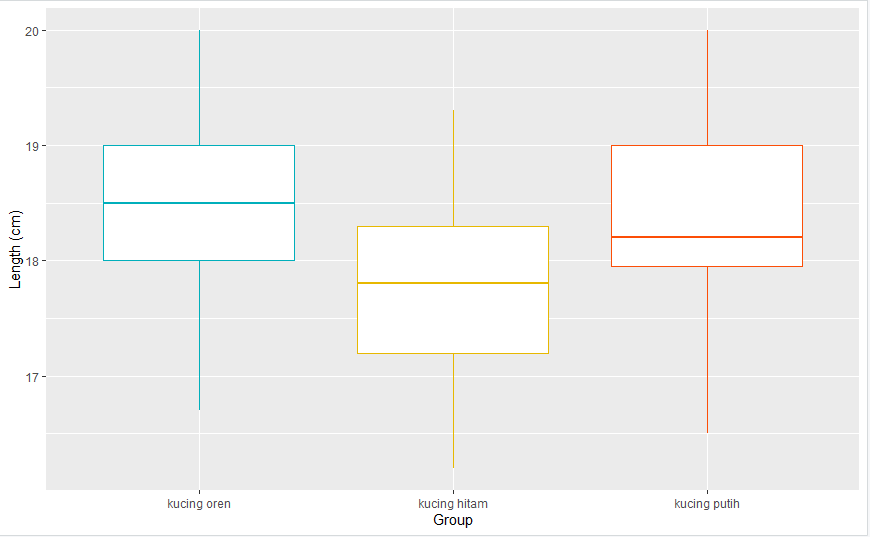

# P2_Probstat_D_5025201252

Praktikum 2 Probabilitas dan Statistik 2022

```
Nama    : Okyan Awang Ramadhana
NRP     : 5025201252
Kelas   : Probstat E
```

## Soal 1
Seorang peneliti melakukan penelitian mengenai pengaruh aktivitas 𝐴 terhadap kadar saturasi oksigen pada manusia. Peneliti tersebut mengambil sampel sebanyak 9 responden. Pertama, sebelum melakukan aktivitas 𝐴, peneliti mencatat kadar saturasi oksigen dari 9 responden tersebut. Kemudian, 9 responden tersebut diminta melakukan aktivitas 𝐴. Setelah 15 menit, peneliti tersebut mencatat kembali kadar saturasi oksigen dari 9 responden tersebut. Berikut data dari 9 responden mengenai kadar saturasi oksigen sebelum dan sesudah melakukan aktivitas 𝐴

Berdasarkan data pada tabel diatas, diketahui kadar saturasi oksigen dari
responden ke-3 ketika belum melakukan aktivitas 𝐴 sebanyak 67, dan setelah
melakukan aktivitas 𝐴 sebanyak 70.

### 1.A
_Carilah Standar Deviasi dari data selisih pasangan pengamatan tabel
diatas_

- kita akan mengekstrak data dari tabel tersebut dengan fungsi `c()` yang akan melakukan kombinasi menjadi vector pada data tabel kemudian disimpan pada variabel `x` dan `y`

```
x <- c(78,75,67,77,70,72,28,74,77)
y <- c(100,95,70,90,90,90,89,90,100)
```
- Visualisasi variabel `x` dan `y` akan disimpan kedalam `data`
- Kemudian dihitung standar deviasinya denggan fungsi `sd()`
```
cat(sprintf("S. Deviasi data X -> %f", sd(x)))
cat(sprintf("S. Deviasi data X -> %f", sd(y)))
```


### 1.B
_carilah nilai t (p-value)_
`t-value` merupakan cara untuk mengukur perbedaan antara rata-rata populasi dan `p-value` adalah probabilitas untuk memperoleh `t-value` dengan nilai absolut setidaknya sebesar yang sebenarnya kita amati dalam data sampel jika nol hipotesis sebenarnya benar
disini hipotesa kita adalah `greater`
```
alt <- "greater"
t.test(x, y, alternative = alt, var.equal = FALSE)
```


### 1.C

_tentukanlah apakah terdapat pengaruh yang signifikan secara statistika
dalam hal kadar saturasi oksigen , sebelum dan sesudah melakukan
aktivitas 𝐴 jika diketahui tingkat signifikansi 𝛼 = 5% serta H0 : “tidak ada
pengaruh yang signifikan secara statistika dalam hal kadar saturasi
oksigen , sebelum dan sesudah melakukan aktivitas 𝐴”_

- `tidak ada pengaruh yang signifikan` oleh karena itu, disini kita akan terlebih dahulu membandingkan data pada kolom `x` dan `y` dengan

```
var.test(x, y)
```

- kemudian diikuti dengan percobaan dengan `t.test()` untuk mengetahui apakah terdapat pengaruh yang signifikan secara statistika dalam hal kadar saturasi oksigen , sebelum dan sesudah melakukan aktivitas 𝐴

```
t.test(x, y, mu = 0, var.equal = TRUE)
```

sebelum


setelah


dapat dilihat bahwa jika dibandingkan dengan nilai sebelumnya, tidak terjadi perbedaan nilai yang signifikan setelah aktivitas 𝐴

## Soal 2

Diketahui bahwa mobil dikemudikan rata-rata lebih dari 20.000 kilometer per tahun.
Untuk menguji klaim ini, 100 pemilik mobil yang dipilih secara acak diminta untuk
mencatat jarak yang mereka tempuh. Jika sampel acak menunjukkan rata-rata
23.500 kilometer dan standar deviasi 3900 kilometer.

### 2.A
_Apakah Anda setuju dengan klaim tersebut?_ Setuju
### 2.B
_Jelaskan maksud dari output yang dihasilkan!_
```
library(BSDA)
## diketahui
rata_rata <- 23500
standar_deviasi <- 3900
pemilik_mobil <- 100
## hasil
tsum.test(
  mean.x = rata_rata,
  sd(standar_deviasi),
  n.x = pemilik_mobil,
  var.equal = FALSE)
```

### 2.C
- Kita pertama akan menghitung nilai dari `p-value` dari data diatas
```
data.mean <- 235000
data.a <- 20000
data.sd <- 3900
data.n <- 100
z <- (data.mean-data.a)/(data.sd/sqrt(data.n))
2*pnorm(-abs(z))
```


- dari nilai `p-value = 0` maka diketahui hipotesis nol ditolak dan pengujian kita signifikan secara statistik. Oleh karena itu, dapat kita tarik kesimpulan bahwa

```
Mobil dikemudikan rata-rata lebih dari 20.000 kilometer/tahun
```
### Nomor 3
Diketahui perusahaan memiliki seorang data analyst ingin memecahkan permasalahan pengambilan keputusan dalam perusahaan tersebut. Selanjutnya didapatkanlah data berikut dari perusahaan saham tersebut.
</br>

Dari data diatas berilah keputusan serta kesimpulan yang didapatkan dari hasil diatas. Asumsikan nilai variancenya sama, apakah ada perbedaan pada rata-ratanya (α= 0.05)? Buatlah :

#### 3a
H0 dan H1
dilakukan perhitungan H0 sebagai berikut
</br>

</br>
dilakukan perhitungan H1 sebagai berikut
</br>


#### 3b
Hitung Sampel Statistik
Penghitungan dilakukan sebagai berikut
```
tsum.test(mean.x=3.64, s.x = 1.67, n.x = 19, mean.y =2.79 , s.y = 1.32, n.y = 27, alternative = "greater", var.equal = TRUE)
```


#### 3c
Lakukan Uji Statistik (df =2)
Melakukan install library `mosaic`
```
install.packages("mosaic")
library(mosaic)
```

```
plotDist(dist='t', df=2, col="blue")
```


#### 3d
Nilai kritikal
Adapun untuk mendapatkan nilai kritikal bisa menggunakan `qchisq` dengan `df=2` sesuai soal sebelumnya


#### 3e
Teori keputusan adalah teori formal pengambilan keputusan di bawah ketidakpastian. 
Aksinya adalah : `({a}_{a∈A})`
Kemungkinan konsekuensi : `({c}_{c∈C})` (tergantung pada keadaan dan tindakan)
Maka keputusan dapat dibuat dengan `t.test`

#### 3f
Kesimpulan
Kesimpulan yang didapatkan yaitu perbedaan rata-rata yang terjadi tidak ada jika dilihat dari uji statistik dan akan ada tetapi tidak signifikan jika dipengaruhi nilai kritikal.

## 4.
Seorang Peneliti sedang meneliti spesies dari kucing di ITS . Dalam penelitiannya ia mengumpulkan data tiga spesies kucing yaitu kucing oren, kucing hitam dan kucing putih dengan panjangnya masing-masing. Jika :
Diketahui dataset https://intip.in/datasetprobstat1
H0 : Tidak ada perbedaan panjang antara ketiga spesies atau rata-rata panjangnya sama

```
onewayanova = read.table("onewayanova.txt",h=T)
onewayanova
```
### a. Buatlah masing masing jenis spesies menjadi 3 subjek "Grup" (grup 1,grup2,grup 3). Lalu Gambarkan plot kuantil normal untuk setiap kelompok dan lihat apakah ada outlier utama dalam homogenitas varians.
Karena setiap grup nya berdistribusi normal maka tidak ada outlier utama. Untuk membuat grup tiap jenis nya, bisa menggunakan factor kemudian memberikan label dan subset setiap grup. Group1 adalah kucing oren, Group2 adalah kucing hitam dan Group3 adalah kucing putih.
```
# set group jadi factor
onewayanova$Group <- as.factor(onewayanova$Group)
# memberikan label
onewayanova$Group = factor(onewayanova$Group,labels = c("kucing oren", "kucing hitam", "kucing putih"))
Group1 <- subset(onewayanova, Group == "kucing oren")
Group2 <- subset(onewayanova, Group == "kucing hitam")
Group3 <- subset(onewayanova, Group == "kucing putih")
```

Kemudian menggambarkan plot kuantil normal untuk tiap grup seperti berikut
```
qqnorm(Group1$Length)
qqline(Group1$Length)
qqnorm(Group2$Length)
qqline(Group2$Length)
qqnorm(Group3$Length)
qqline(Group3$Length)
```
  

### b. carilah atau periksalah Homogeneity of variances nya, Berapa nilai p yang didapatkan? , Apa hipotesis dan kesimpulan yang dapat diambil ?
Untuk memeriksa homogenitas varians dilakukan seperti berikut
```
bartlett.test(Length ~ Group, data = onewayanova)
```


Didapatkan p-value sebesar 0.8054, p-value berada diatas 0.05 yang artinya varians dari ketiga kelompok sama dan kesimpulannya terdapat homogenitas varians untuk melakukan anova satu arah (one way).

### c. Untuk uji ANOVA (satu arah), buatlah model linier dengan Panjang versus Grup dan beri nama model tersebut model 1.
```
model1 = lm(Length ~ Group, data = onewayanova)
anova(model1)
```


### d. Dari Hasil Poin C, Berapakah nilai-p?, Apa yang dapat Anda simpulkan dari H0?
Didapatkan nilai F-value = 7.0982, yang berarti nilai P-value lebih kecil dari 0.05. Kesimpulannya kita menolak null hypotesis / H0, maka menunjukkan adanya perbedaan panjang antara ketiga spesies atau rata-rata panjangnya sama.

### e. Verifikasilah jawaban model 1 dengan Post-hoc test Tukey HSD, dari nilai p yang didapatkan apakah satu jenis kucing lebih panjang dari yang lain? Jelaskan.
Dilakukan Post-hoc test Tukey HSD untuk mengetahui perbandingan tiap-tiap spesies
```
TukeyHSD(aov(model1))
```


Dari hasil diatas dapat diketahui p-value tiap 2 jenis grup. Jika p-value lebih kecil dari 0.05, maka panjang kedua grup berbeda, jika p-value lebih dari 0.05 maka panjangnya sama. Berdasarkan hasil diatas dapat disimpulkan kucing putih dan kucing oren memiliki ukuran atau panjang yang sama.

### f. Visualisasikan data dengan ggplot2
```
ggplot(onewayanova, aes(x = Group, y = Length)) +
  geom_boxplot(color = c("#00AFBB", "#E7B800", "#FC4E07")) +
  scale_x_discrete() + xlab("Group") + ylab("Length (cm)")
```


## Soal No. 5
Pertama-tama, download `.csv` lalu letakkan `.csv` pada directory `C:\Users\USER\Documents`, lalu read isi `.csv`
```r
GTL <- read_csv("GTL.csv")
head(GTL)
str(GTL)
```
### 5A
```r
soal_5a<-function(){
  qplot(x = Temp, y = Light, geom = "point", data = GTL) +
    facet_grid(.~Glass, labeller = label_both)
}
soal_5a()
```

### 5B
```r
#5B
soal_5b<-function(){
  GTL$Glass <- as.factor(GTL$Glass)
  GTL$Temp_Factor <- as.factor(GTL$Temp)
  str(GTL)
  
  anova <- aov(Light ~ Glass*Temp_Factor, data = GTL)
  summary(anova)
}
soal_5b()
```

### 5C
```r
soal_5c<-function(){
  data_summary <- group_by(GTL, Glass, Temp) %>%
    summarise(mean=mean(Light), sd=sd(Light)) %>%
    arrange(desc(mean))
  print(data_summary)
}
soal_5c()
```

### 5D
```r
soal_5d<-function(){
  tukey <- TukeyHSD(anova)
  print(tukey)
}
soal_5d()
```

### 5E
```r
soal_5e<-function(){
  tukey.cld <- multcompLetters4(anova, tukey)
  print(tukey.cld)
  
  cld <- as.data.frame.list(tukey.cld$`Glass:Temp_Factor`)
  data_summary$Tukey <- cld$Letters
  print(data_summary)
  
  #Opsional: export .csv
  write.csv("GTL_summary.csv")
}
soal_5e()
```
